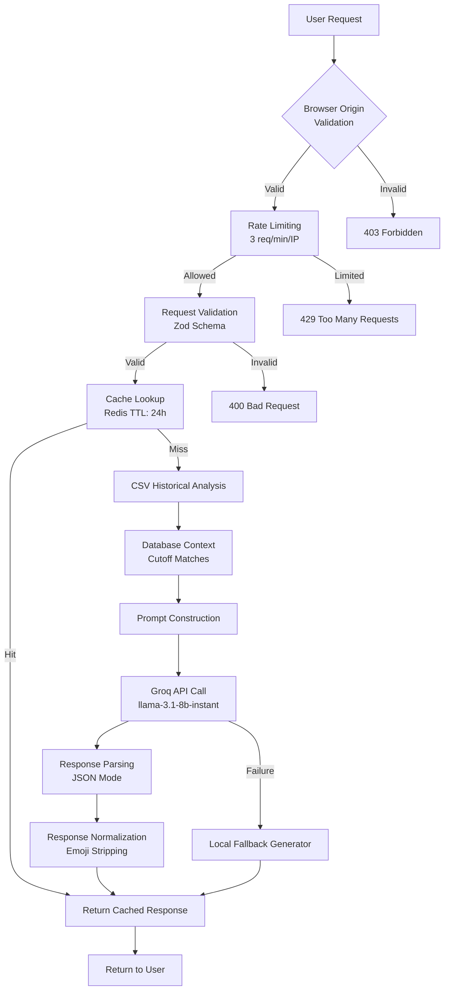

# AI Prediction Mode

## Overview

The AI Prediction Mode leverages Groq's LLM (Large Language Model) to provide personalized counseling advice for BCECE candidates. This feature goes beyond basic rank-based predictions by offering contextual guidance, college recommendations, and counseling tips based on historical data and AI reasoning.

## Architecture Diagram



## Component Breakdown

### 1. Browser Origin Validation
**Purpose**: Prevent direct API abuse and ensure requests come from legitimate browser sessions.

**Implementation**:
- Checks `Origin` and `Referer` headers against whitelist
- Allows same-origin requests (`sec-fetch-site: same-origin`)
- Permits CORS requests from whitelisted origins
- Development mode bypass for local testing

**Whitelisted Domains**:
- `http://localhost:3000` (development)
- `http://localhost:3001` (alternative development)
- `https://bcece-predictor.vercel.app` (production)
- `https://studywithritesh.in` and subdomains
- `https://predictor-swr.vercel.app` (alternative production)

### 2. Rate Limiting
**Purpose**: Protect Groq API quota and prevent abuse.

**Limits**:
- 3 requests per minute per IP address
- 60-second sliding window
- Implemented via Upstash Redis

**Headers**:
- `X-RateLimit-Limit`: 3
- `X-RateLimit-Remaining`: Remaining requests
- `X-RateLimit-Reset`: Timestamp of window reset
- `Retry-After`: Seconds until reset (when limited)

### 3. Request Validation
**Purpose**: Ensure request data integrity and prevent injection.

**Schema** (Zod):
```typescript
{
  subGroup?: z.enum(["PCM", "PCB", "PCMB"]).optional(),
  category: z.enum(["UR", "BC", "EBC", "SC", "ST"]),
  rankType: z.enum(["PCM", "PCB"]),
  rankSubCategory: z.enum(["UR", "CAT", "RCG", "DQ", "SMQ"]),
  rankValue: z.coerce.number().int().positive(),
  predictions: z.array(z.any()) // From standard prediction API
}
```

### 4. Cache Layer (Redis)
**Purpose**: Reduce Groq API calls and improve response time.

**Configuration**:
- TTL: 24 hours
- Key format: `swr:ai:cache:{subGroup}:{category}:{rankType}:{rankSubCategory}:{rankValue}`
- Graceful degradation when Redis unavailable

### 5. Historical Data Analysis
**Purpose**: Provide contextual grounding for AI responses.

**Sources**:
- Local CSV file: `REVISED_PCMB-Joint_1st_Round_Allotment_16082025.xlsx.csv`
- Contains historical allotment data from BCECE 2025 Round 1

**Analysis Logic**:
1. Identify rank column based on `rankType` and `rankSubCategory`
2. Calculate rank window (±30% of user rank)
3. Find matching historical allotments within window
4. Fallback to absolute window (±50 ranks) if insufficient matches
5. Limit to 8 most relevant matches for context

### 6. Prompt Engineering
**Purpose**: Guide LLM to produce accurate, safe, and useful counseling advice.

**System Prompt Features**:
- Strict JSON-only response requirement
- Anti-hallucination constraints (no fabricating data)
- Professional tone guidelines (no emojis, concise sections)
- Role definition as BCECE counseling advisor
- Data grounding instructions
- Response format specification

**Context Provided**:
- Candidate profile (group, category, rank type/value)
- Database cutoff matches (top 10 by relevance)
- Historical allotment records from CSV analysis

### 7. Groq API Integration
**Purpose**: Generate intelligent counseling advice using LLM.

**Configuration**:
- Model: `llama-3.1-8b-instant`
- Parameters:
  - Temperature: 0.2 (low for consistency)
  - Max tokens: 1200
  - Response format: `json_object`
- Endpoint: `https://api.groq.com/openai/v1/chat/completions`

**Safety Measures**:
- JSON mode prevents parsing errors
- Temperature control reduces randomness
- Strict system prompt limits response scope
- Post-processing normalization and emoji stripping

### 8. Response Normalization
**Purpose**: Ensure consistent frontend-compatible responses.

**Process**:
1. Parse Groq JSON response
2. Normalize field names (handle variations like `profile_analysis`)
3. Strip emojis from all text fields using Unicode regex
4. Provide default values for missing fields
5. Validate data types and structures

### 9. Local Fallback Generator
**Purpose**: Ensure service availability during Groq API outages.

**Features**:
- Generates structured advice based on historical data
- Creates choice filling list from top predictions
- Provides standard counseling tips
- Maintains same response format as AI-generated responses

## Prediction Logic

### Data Flow
1. **Input Validation**: User data validated via Zod schema
2. **Cache Check**: Redis lookup for identical recent requests
3. **Context Gathering**:
   - Database: Top 10 cutoff matches from standard prediction
   - CSV: Historical allotments matching user's rank profile
4. **Prompt Assembly**: System prompt + user context + gathered data
5. **LLM Invocation**: Groq API call with strict parameters
6. **Response Processing**: Parsing, normalization, safety filtering
7. **Caching**: Store successful response in Redis
8. **Delivery**: Return to user with rate limit headers

### Hallucination Prevention
Multiple layers prevent AI from fabricating information:

1. **System Prompt Constraints**:
   - Explicit prohibition against fabricating cutoff values, college names, or statistics
   - Instruction to state clearly when data is insufficient
   - Requirement to use only provided data

2. **Context Limitation**:
   - Only database cutoff matches and verified CSV historical data provided
   - No access to external knowledge or training data beyond context

3. **Response Validation**:
   - Post-processing removes emojis and non-compliant content
   - Fallback to local generator if response parsing fails
   - Default responses when AI output is malformed

4. **Temperature Control**:
   - Low temperature (0.2) favors deterministic, factual responses
   - Reduces creativity that could lead to hallucination

## Counseling Advice Structure

### Profile Analysis
- Markdown formatted with `###` headings
- Uses `**bold**` for emphasis
- 3-5 sentences maximum
- Objective assessment based on data
- No guarantees or promises

### Choice Filling List
- Array of objects with priority ranking (1-based)
- Institute name (short form from database)
- Branch name (full form from database)
- One-line factual reason based on historical data

### Counseling Tips
- Array of 3-5 actionable recommendations
- Based on standard BCECE counseling best practices
- Document preparation, strategy, and procedural advice

## Performance Characteristics

### Latency Breakdown
- Cache Hit (Redis): 50-150ms
- Cache Miss + Groq API: 2,000-5,000ms
- CSV Analysis: 50-150ms
- Local Fallback: 10-50ms

### Scaling Factors
- Request volume limited by rate limiting (3/min/IP)
- Redis cache effectiveness improves with repeated similar queries
- Groq API latency is primary variable factor
- Horizontal scaling via Vercel edge functions

### Resource Usage
- Memory: Minimal (primarily request/response objects)
- CPU: Low (mostly I/O bound waiting for APIs/Groq)
- Network: Calls to Supabase, Upstash Redis, Groq API
- Storage: Temporary CSV parsing in memory

## Error Handling and Resilience

### Failure Modes
1. **Browser Origin Rejection**: 403 Forbidden
2. **Rate Limit Exceeded**: 429 Too Many Requests (with retry-after)
3. **Validation Failure**: 400 Bad Request (with details)
4. **Groq API Unavailable**: Automatic fallback to local generator
5. **Redis Unavailable**: Graceful degradation (no caching)
6. **CSV File Missing**: Continues with database context only
7. **Unexpected Errors**: 500 Internal Server Error (logged)

### Recovery Mechanisms
- **Fallback Chain**: Groq API → Local Generator → Static Tips
- **Cache Penetration Protection**: Single-flight pattern via request deduplication
- **Circuit Breaker**: Not implemented but detectable via failure rates
- **Graceful Degradation**: Core prediction functionality unaffected

## Security Considerations

### Input Sanitization
- All user inputs validated via Zod before processing
- Rank values bounded by positive integer constraint
- Enumerated fields restricted to known values
- String inputs limited to reasonable lengths

### API Protection
- Browser origin validation prevents direct programmatic abuse
- Rate limiting protects AI service quotas
- Response normalization prevents injection via emojis or special characters
- Error messages generic to prevent information leakage

### Data Privacy
- No personal data stored beyond request processing
- Historical data is anonymized aggregate statistics
- AI prompts contain only anonymized profile information
- Conversations not logged or stored beyond caching

## Configuration

### Environment Variables
- `GROQ_API_KEY`: Required for AI functionality
- `UPSTASH_REDIS_REST_URL`: Optional for rate limiting/caching
- `UPSTASH_REDIS_REST_TOKEN`: Optional for rate limiting/caching
- `NODE_ENV`: Affects origin validation strictness

### Feature Flags
- AI functionality disabled if `GROQ_API_KEY` missing
- Rate limiting disabled if Redis credentials missing
- Browser origin validation relaxed in development mode

## Future Enhancements

### Improvements
1. **Vector Embeddings**: Use Supabase pgvector for semantic similarity search
2. **Feedback Loop**: Collect user outcomes to improve future recommendations
3. **Multi-Language Support**: Expand beyond English counseling
4. **Explainability**: Show which historical data points influenced recommendations
5. **Uncertainty Quantification**: Provide confidence scores for AI advice

### Performance Optimizations
1. **Edge Caching**: Vercel Edge Config for frequent requests
2. **Request Batching**: Combine similar queries for efficiency
3. **Model Quantization**: Use smaller/faster models for common queries
4. **Predictive Caching**: Pre-generate responses for likely rank ranges